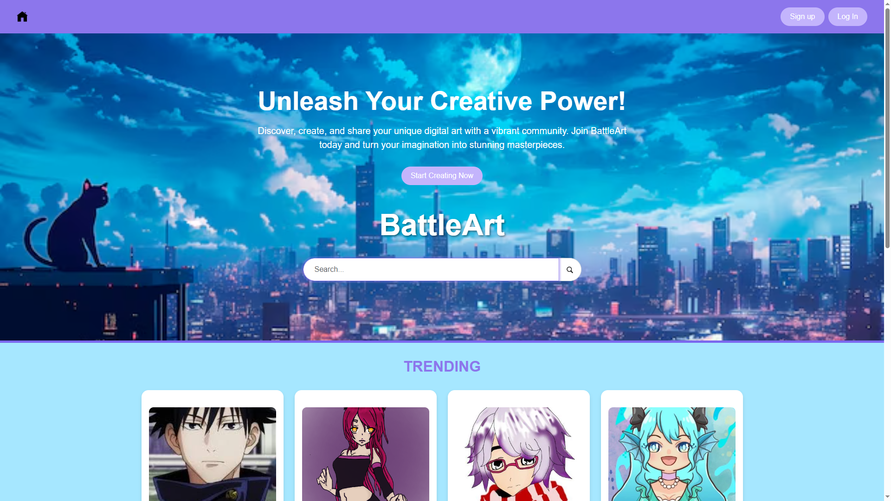
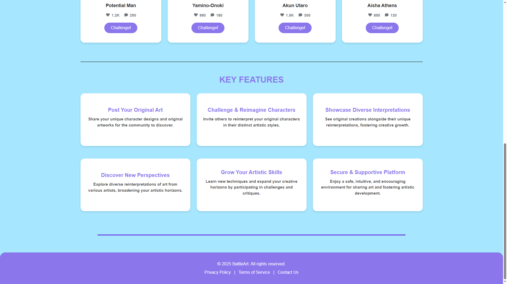
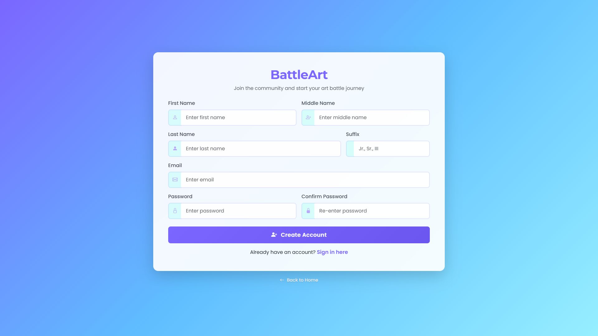
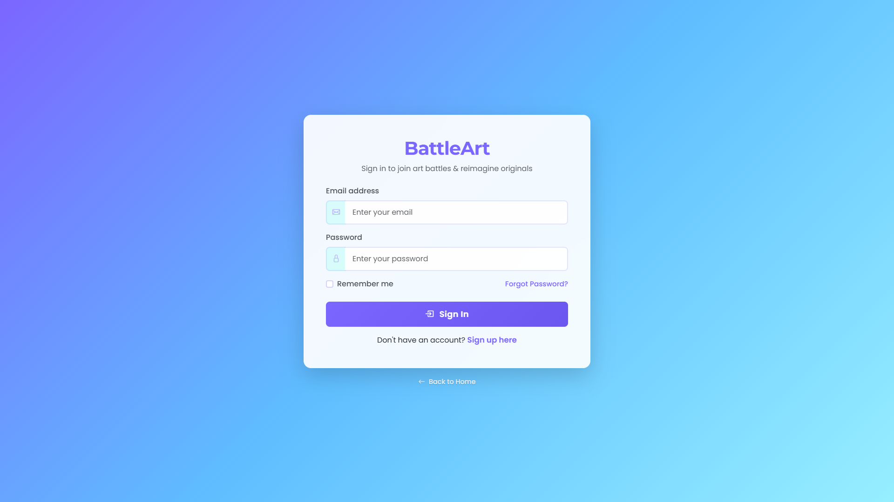
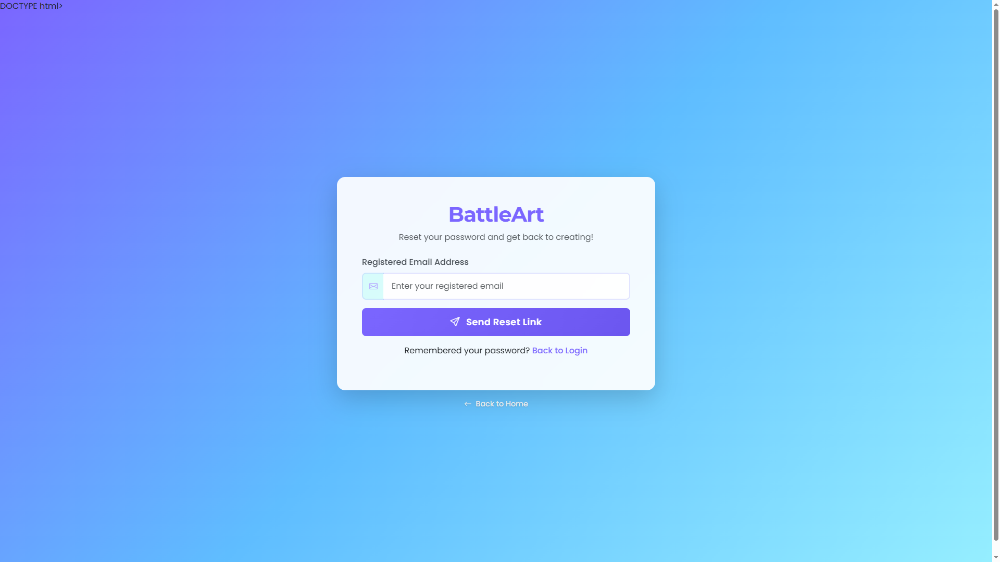

# **BattleArt: Online Art Showdown**

> *Where creativity meets challenge — Reimagine, Compete, and Inspire.*

---

## About
**BattleArt** is a PHP-based art platform where artists can showcase their original works and challenge others to create reimagined versions.  
Originals and reinterpretations are displayed side by side, fostering:  

- Creativity  
- Constructive feedback  
- A supportive art community  

---

## 👥 Group Members
1. IAN LANCE DELA CRUZ 
2. JAMES IAN CAÑETE  
3. GABRIEL MONTIL  
4. RIANEL LUMBACA  

---

## 🖼️ Screenshots

### Homepage  




### Registration Page  


### Login Page  


### Forgot Password Page  


---

## Live Demo
👉 [BattleArt Live Demo](https://bonelessgod44.github.io/BattleArt/)

---

## Setup Instructions
1. Clone the repo:  
   ```bash
   git clone https://github.com/your-username/battleart.git

